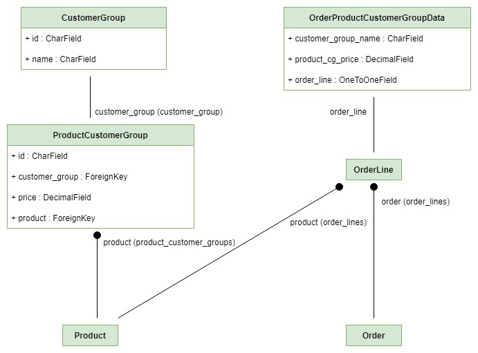
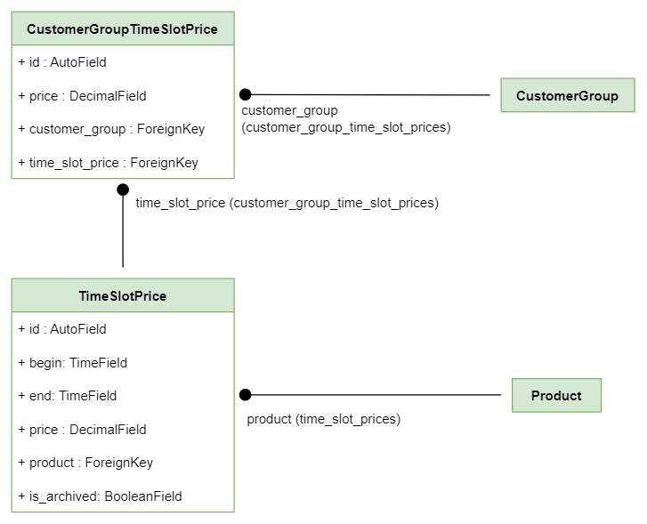
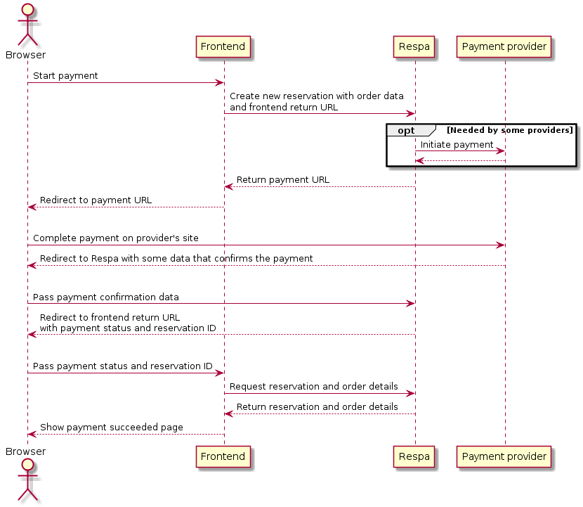
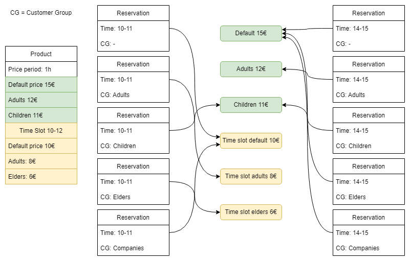

# Payments

Payments app adds support for Respa resources to have paid reservations. In addition to requiring a mandatory rent for a resource's usage, it is also possible to offer optional extra accessories to be ordered and paid.

Transactions are handled by a third party payment provider. Currently implemented provider integrations:

* [Bambora Payform](https://www.bambora.com/fi/fi/online/)
* Turku MaksuPalvelu

## Enabling and configuring Payments

There are a couple of required configuration keys that need to be set in order to enable the payments and the third party provider currently in use:

- `RESPA_PAYMENTS_ENABLED`: Whether payments are enabled or not. Boolean `True`/`False`. The default value is `False`.
- `RESPA_PAYMENTS_PROVIDER_CLASS`: Dotted path to the active provider class e.g. `payments.providers.BamboraPayformProvider` as a string. No default value.
- `RESPA_PAYMENTS_PAYMENT_WAITING_TIME`: In minutes, how old the potential unpaid orders/reservations have to be in order for Respa cleanup to set them expired. The default value is `15`.

`./manage.py expire_too_old_unpaid_orders` runs the order/reservation cleanup for current orders. You'll probably want to run it periodically at least in production. [Cron](https://en.wikipedia.org/wiki/Cron) is one candidate for doing that.

### Bambora Payform configuration

The Bambora API version the provider implementation targets is `w3.1`. More information about the API can be found in [Bambora's official API documentation](https://payform.bambora.com/docs/web_payments/?page=full-api-reference) page.

In addition to the general configuration keys mentioned in the previous section, enabling Bambora also requires some extra configuration to function:

- `RESPA_PAYMENTS_BAMBORA_API_URL`: Optionally override the base URL where Bambora requests are sent. Defaults to the documented Bambora endpoint.
- `RESPA_PAYMENTS_BAMBORA_API_KEY`: Identifies which merchant store account to use with Bambora. Value can be found in the merchant portal. Provided as a string. No default value.
- `RESPA_PAYMENTS_BAMBORA_API_SECRET`: Used to calculate hashes out of the data being sent and received, to verify it is not being tampered with. Also found in the merchant portal and provided as a string. No default value.
- `RESPA_PAYMENTS_BAMBORA_PAYMENT_METHODS`: An array of payment methods to show to the user to select from e.g.`['nordea', 'creditcards']`. Full list of supported values can be found in [the currencies section of](https://payform.bambora.com/docs/web_payments/?page=full-api-reference#currencies) Bambora's API documentation page.

### Turku MaksuPalvelu configuration

The Turku MaksuPalvelu REST API version the provider implementation targets is `v1`.

In addition to the general configuration keys mentioned in the basic payments configuration section, enabling Turku MaksuPalvelu also requires some extra configuration to function:

- `RESPA_PAYMENTS_TURKU_API_URL`: The URL where Turku MaksuPalvelu requests are sent.
- `RESPA_PAYMENTS_TURKU_API_KEY`: The authentication key given to Respa by MaksuPalvelu for REST API calls.
- `RESPA_PAYMENTS_TURKU_API_APP_NAME`: The application name given to Respa by MaksuPalvelu for REST API calls.

## Basics

Model `Product` represents everything that can be ordered and paid alongside a reservation. Products are linked to one or multiple resources.

There are currently two types of products:

- `rent`: At least one product of type `rent` must be ordered when such is available on the resource.

- `extra`: Ordering of products of type `extra` is not mandatory, so when there are only `extra` products available, one can create a reservation without an order. However, when an order is created, even with just extra product(s), it must be paid to get the reservation confirmed.

Everytime a product is saved, a new copy of it is created in the db, so product modifying does not affect already existing orders.

All prices are in euros. A product's price is stored in `price` field. However, there are different ways the value should be interpreted depending on `price_type` field's value:

- `fixed`: The price stays always the same regardless of the reservation, so if `price` is `10.00` the final price is 10.00 EUR.

- `per_period`: When price type is `per_period`, field `price_period` contains length of the period, for example if `price` is `10.00` and `price_period` is `00:30:00` it means the actual price is 10.00 EUR / 0.5h

Model `Order` represents orders of products. One and only one order is linked to exactly one reservation.

An order can be in state `waiting`, `confirmed`, `rejected`, `expired` or `cancelled`. A new order will start from state `waiting`, and from there it will change to one of the other states. Only valid other state change is from `confirmed` to `cancelled`.

An order is created by providing its data in `order` field when creating a reservation via the API. The UI must also provide a return URL to which the user will be redirected after the payment process has been completed. In the creation response the UI gets back a payment URL, to which it must redirect the user to start the actual payment process.

## Customer Groups

Products can have special pricing based on customer groups (cg). Cgs are represented with the following models:

- `CustomerGroup`: Common to all products containing cg naming e.g. Elders, Adults or Children.

- `ProductCustomerGroup`: Unique special pricing for certain cg for a product.

Cgs are not required in products and there can be any number of them defined per product.

Normally a product's price must be over 0.00 EUR, but product customer groups (pcg) can be defined to have special pricing of 0.00 EUR. If a reservation's order total price is 0.00 EUR, the reservation is completed without the payment process.

Orders can be made with products which have differing cgs or no cgs at all. Pricing is calculated based on given order's cg and if a product doesn't contain the given cg, the product's default pricing is used instead.

Model `OrderProductCustomerGroupData` is used to store pcg price and cg name (if order's cg is defined in the product) per order line. Price data is stored so that later modifications to pcgs won't change the order line price after the payment has been made.

## Time slot pricing

Products can have differently priced time slots e.g., 10-12 with price of 10 EUR/h and 14-16 with price of 12 EUR/h. In the previous example if the product's default price is 6 EUR/h a reservation made between 11-12 would cost 10 EUR and a reservation made between 13-15 would cost 18 EUR.

Time slot pricing is represented by the following models:

- `TimeSlotPrice`: Defines a time range with special pricing for a product.

- `CustomerGroupTimeSlotPrice`: Unique special pricing for certain cg for a time slot.

Time slot pricing can be used with both product price types `per_period` and `fixed`.

Type `per_period` products' time slots use the product's `price_period` unit e.g., per one hour for pricing.

Type `fixed` products' time slots work by selecting the most accurate i.e., smallest duration time slot which fits for the given reservation. For example, a product that has time slots 10-12 and 10-14 would price a reservation made between 11-12 with the 10-12 time slot's price.

Each time slot can have any number of cg prices in addition to the time slot's default price. Product's time slots don't have to have the same cgs between themselves. Similarly, product's time slot cgs and product's own pcgs don't have to be the same but it is advisable to define all the desired cgs used by time slots for the product itself as well. Doing so makes the product's pricing easier to understand and easier to use by the applications using the product API.

Every time a product or time slot price is saved via admin interface, new copies of time slot objects are created in the db, so product or time slot modifying does not affect already existing orders.

## Pricing priority

Time slots and customer groups create complex pricing situations for products. A product with time slots but no cgs use time slot pricing when reservation overlaps with time slots and default pricing otherwise. Similarly, a product with cgs but no time slots use cg pricing when reservation's cg is defined in the product and when not defined, default pricing is used. When cgs and time slots are used at the same time in product the following priority rules apply:

- Product default price is used:
    - When reservation takes place outside of defined time slots and no cg is given or given cg is not defined in the product.

- Time slot default price is used:
    - When reservation takes place over defined time slots and no cg is given or given cg is not defined in the time slot and product.

- Time slot cg price is used:
    - When reservation takes place over defined time slots and given cg is defined in the time slots.

- Product cg price is used:
    - When reservation takes place outside of defined time slots and given cg is defined in the product
    - When reservation takes place over time slots but these time slots don't have the given cg defined in them, but the product does have the given cg defined.

## Manually confirmed reservations

Reservations which require manual confirmation are not paid during initial reservation creation. Instead, the payment flow is as follows:

1. Customer makes the initial reservation.

2. Staff confirms the reservation which changes the reservation state from `requested` to `ready_for_payment`.

3. Customer initiates the payment process by making a reservation update request with order which changes the reservation state from `ready_for_payment` to `waiting_for_payment`.

4. Reservation process continues like normal paid reservations.

If a reservation's order total price is 0.00 EUR, the reservation is treated like a manually confirmed reservation without an order i.e. when staff confirms the reservation, its state changes directly from `requested` to `confirmed`.

Staff members follow the normal payment flow when making reservations to resources requiring manual confirmation i.e. they make the payment at the initial reservation creation.

## Administration

Currently Django Admin needs to be used for all administrative tasks, ie. adding / modifying / deleting products, and viewing / cancelling orders.

## Permissions

- By default it is not possible to modify reservations that have an order using the API. Permission to modify a paid reservation can be granted using resource permission `can_modify_paid_reservation`.
    - Manually confirmed reservations that have an order are an exception. Modifications to reservations are allowed without special permissions before reservation state is changed to `confirmed`.

- Everyone can see only their own orders' data in the API. With resource permission `can_view_reservation_product_orders` one can view all other users' order data as well.

## API usage

### Checking available products

Resources have `products` field that contains a list of the resource's products.

Example response (GET `/v1/resource/`):

```json
...

"products": [
    {
        "id": "awevmfmr3w5a",
        "type": "rent",
        "name": {
            "fi": "testivuokra",
            "en": "test rent"
        },
        "description": {
            "fi": "Testivuokran kuvaus.",
            "en": "Test rent description."
        },
        "tax_percentage": "24.00",
        "price": "10.00",
        "price_type": "per_period",
        "price_period": "01:00:00",
        "max_quantity": 1,
        "product_customer_groups": [
            {
                "id": "adults-pcg-id",
                "price": "9.00",
                "customer_group": {
                    "id": "adults-cg-id",
                    "name": {
                        "fi": "Aikuiset",
                        "en": "Adults"
                    }
                }
            }
        ],
        "time_slot_prices": [
            {
                "id": 123,
                "begin": "10:00:00",
                "end": "12:00:00",
                "price": "15.00",
                "customer_group_time_slot_prices": [
                    {
                        "id": 123,
                        "price": "5.00",
                        "customer_group": {
                            "id": "adults-cg-id",
                            "name": {
                                "fi": "Aikuiset",
                                "en": "Adults"
                            }
                        }
                    }
                ]
            }
        ]
    }
],

...
```

### Checking the price of an order

Price checking endpoint can be used to check the price of an order without actually creating the order.

Example request (POST `/v1/order/check_price/`):

```json
{
    "begin": "2019-04-11T08:00:00+03:00",
    "end": "2019-04-11T10:00:00+03:00",
    "order_lines": [
        {
            "product": "awemfcd2iqlq",
            "quantity": 5
        }
    ]
}
```

Adding `"customer_group": "some-cg-id"` to above request's root will apply customer group pricing to the return values.

Example response:

```json
{
    "order_lines": [
        {
            "product": {
                "id": "awemfcd2iqlq",
                "type": "extra",
                "name": {
                    "fi": "testituote"
                },
                "description": {
                    "fi": "testituotteen kuvaus"
                },
                "tax_percentage": "24.00",
                "price": {
                    "type": "per_period",
                    "tax_percentage": "24.00",
                    "amount": "10.00",
                    "period": "01:00:00",
                },
                "max_quantity": 10,
                "product_customer_groups": [
                    {
                        "id": "adults-pcg-id",
                        "price": "9.00",
                        "customer_group": {
                            "id": "adults-cg-id",
                            "name": {
                                "fi": "Aikuiset",
                                "en": "Adults"
                            }
                        }
                    }
                ],
                "time_slot_prices": [
                    {
                        "id": 123,
                        "begin": "10:00:00",
                        "end": "12:00:00",
                        "price": "15.00",
                        "customer_group_time_slot_prices": [
                            {
                                "id": 123,
                                "price": "5.00",
                                "customer_group": {
                                    "id": "adults-cg-id",
                                    "name": {
                                        "fi": "Aikuiset",
                                        "en": "Adults"
                                    }
                                }
                            }
                        ]
                    }
                ]
            },
            "quantity": 5,
            "unit_price": "20.00",
            "price": "100.00"
        }
    ],
    "price": "100.00",
    "begin": "2019-04-11T08:00:00+03:00",
    "end": "2019-04-11T11:00:00+03:00"
}
```

A product's `price` always has `type` field. Existence of other fields depends on the type:

* when the type is `fixed`, there are also fields `tax_percentage` and `amount`
* when the type is `per_period`, there are also fields `tax_percentage`, `amount` and `period`

### Creating an order

Orders are created by creating a reservation normally and including additional `order` field which contains the order's data.

Example request (POST `/v1/reservation/`):

```json
{
    "resource": "av3jzamoxkva",
    "begin": "2019-10-07T11:00:00+03:00",
    "end": "2019-10-07T13:30:00+03:00",
    "event_subject": "kemut",
    "billing_first_name": "Ville",
    "billing_last_name": "Virtanen",
    "billing_phone_number": "555-123456",
    "order": {
        "customer_group": "adults-cg-id",
        "order_lines": [
            {
                "product": "awevmfmr3w5a",
                "quantity": 1
            }
        ],
        "return_url": "https://varaamo.hel.fi/payment-return-url/"
    }
}
```

`customer_group` can be omitted when the order's products don't contain any customer groups.

`return_url` is the URL where the user's browser will be redirected after the payment process. Typically it should be some kind of "payment done" view in the UI.

`quantity` can be omitted when it is 1.

Example response:

```json
...

"order":
    {
        "id": "awemfcd2icdcd",
        "order_lines": [
            {
                "product": {
                    "id": "awevmfmr3w5a",
                    "type": "rent",
                    "name": {
                        "fi": "testivuokra",
                        "en": "test rent"
                    },
                    "description": {
                        "fi": "Testivuokran kuvaus.",
                        "en": "Test rent description."
                    },
                    "price": {
                        "type": "per_period",
                        "tax_percentage": "24.00",
                        "amount": "10.00",
                        "period": "01:00:00",
                    },
                    "max_quantity": 1,
                    "product_customer_groups": [{...}, {...}],
                    "time_slot_prices": [{...}, {...}]
                },
                "quantity": 1,
                "unit_price": "20.00",
                "price": "20.00"
            }
        ],
        "price": "20.00",
        "customer_group_name": {
            "fi": "Aikuiset",
            "en": "Adults"
        },
        "payment_url": "https://payform.bambora.com/pbwapi/token/d02317692040937087a4c04c303dd0da14441f6f492346e40cea8e6a6c7ffc7c",
        "state": "waiting"
    }

...
```

After a successful order creation, the UI should redirect the user to the URL in `payment_url` in order to start a payment process. Once the payment has been carried out, the user is redirected to the return url given when creating the order. The return url will also contain query params `payment_status=<success or failure>` and `reservation_id=<ID of the reservation in question>`.

Example full return url: `https://varaamo.hel.fi/payment-return-url/?payment_status=success&reservation_id=59535434`

### Modifying an order

Modifying an order is not possible, and after a reservation's creation the `order` field is read-only.

### Order data in reservation API endpoint

Reservation data in the API includes `order` field when the current user has permission to view it (either own reservation or via the explicit view order permission).

Example response (GET `/v1/reservation/`):

```json
...

"order": "awemfcd2icdcd",

...
```

Normally when fetching a list of reservations, `order` field contains only the order ID of the order. It is also possible to request for the whole order data by adding query param `include=order_detail` to the request.

Example response (GET `/v1/reservation/?include=order_detail`):

```json
...

"order":
    {
        "id": "awemfcd2icdcd",
        "order_lines": [
            {
                "product": {
                    "id": "awevmfmr3w5a",
                    "type": "rent",
                    "name": {
                        "fi": "testivuokra",
                        "en": "test rent"
                    },
                    "description": {
                        "fi": "Testivuokran kuvaus.",
                        "en": "Test rent description."
                    },
                    "tax_percentage": "24.00",
                    "price": {
                        "type": "per_period",
                        "tax_percentage": "24.00",
                        "amount": "10.00",
                        "period": "01:00:00",
                    },
                    "max_quantity": 1,
                    "product_customer_groups": [{...}, {...}],
                    "time_slot_prices": [{...}, {...}]
                },
                "quantity": 1,
                "unit_price": "20.00",
                "price": "20.00"
            }
        ],
        "price": "20.00",
        "customer_group_name": {
            "fi": "Aikuiset",
            "en": "Adults"
        },
        "state": "confirmed"
    }

...
```

## Adding a new provider

Core functionality of the provider implementation is to first prepare the transaction with the payment provider API, which in Bambora's case means posting the `Order` data there and getting a payment token back to be used as part of the payment URL the customer is redirected to. Second is to handle the customer returning from paying the `Order`, extracting and storing the state and redirecting the customer to the correct destination.

Key steps when adding support for a new provider:

1. Extend and implement `PaymentProvider` base class from `payments.providers.base`
2. Provide a value for the `RESPA_PAYMENTS_PROVIDER_CLASS` configuration key, which is a dotted path to the active provider class

### Configuring the provider

Active payment provider is initialized in providers package init. Before initializing, a static function named `get_config_template()` is called that returns a dict containing the provider specific `key: value type` or `key: (value type, default value)` -items, for example:

```python
return {
    RESPA_PAYMENTS_API_URL: (str, 'https://my_awesome_provider/api'),
    RESPA_PAYMENTS_API_KEY: str,
}
```

Values for these configuration keys are read from either `settings` or `.env`. The base provider constructor then receives the fully loaded configuration and the template keys with their values are usable through `self.config` class variable in the provider.

### Overridable methods

The minimum a new provider implementation needs to implement are these methods:

#### initiate_payment(order)

Starts the payment process by preparing the `Order` to be paid. This might mean posting information about the `Order` to the provider API or just constructing a URL using the data and provider specific API identifiers. Whatever the case, returns the URL where Respa redirects the customer to pay the order. Request object is available as `self.request`.

Respa acts as a mediator between the payment provider and the UI, `request` and `ui_return_url` are needed for creating the correct redirect chain. `get_success_url()` from base creates the success handler URL and by default `ui_return_url` is added to that as an extra query parameter. There is a `handle_failure_request()` -call that can also be overridden if the provider uses a separate callback for failed payments and a `handle_notify_request()` if the provider supports an asynchronous callback.

#### handle_success_request()

When customer has completed the payment, the provider redirects back to this success handler where the payment status is checked. With Bambora, this means extracting query parameters from the URL, checking they haven't been tampered with and marking the `Order` state to reflect the status code. Request object is available as `self.request`.

After the status has been checked, the customer is redirected to the `ui_return_url` that was provided when `Order` was prepared, with additional `payment_status` query parameter stating whether the process was a `success` or a `failure` and an `order_id` parameter.

## Diagrams

### Data structure


#### Customer Groups



#### Time slot prices



### Payment flow



### Pricing examples


